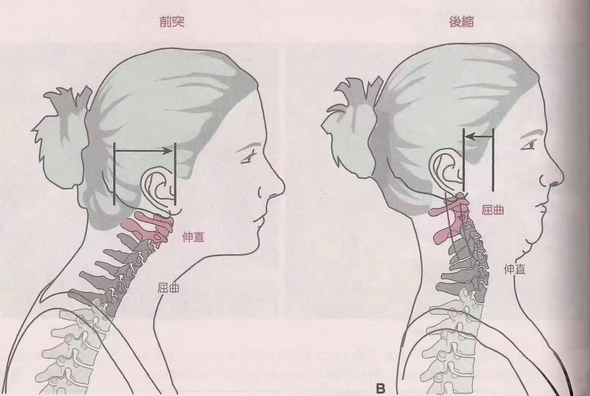
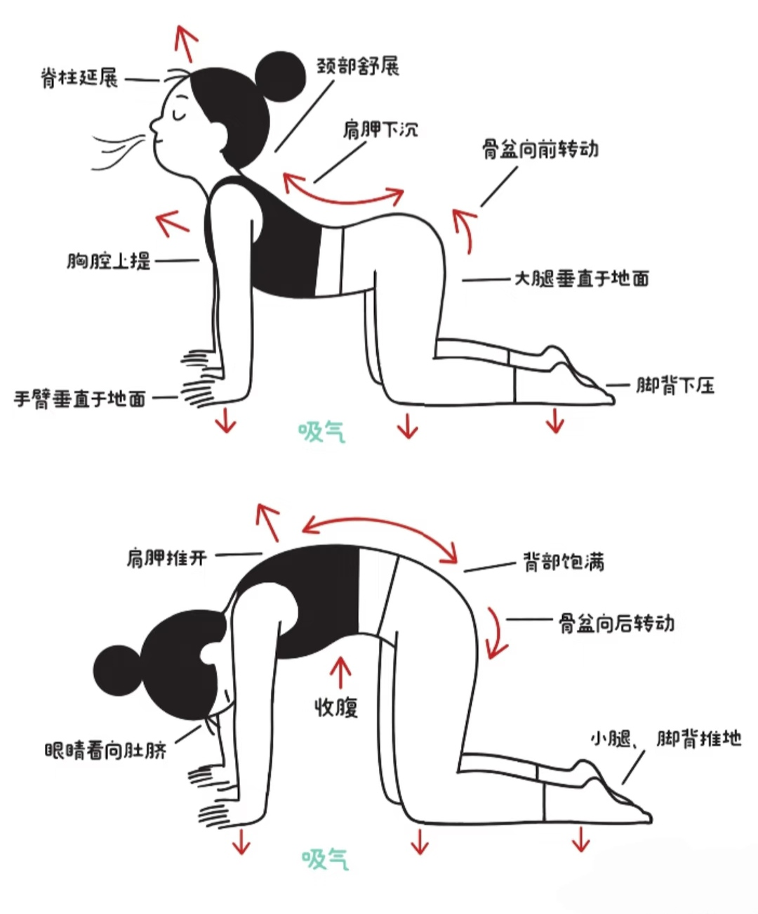
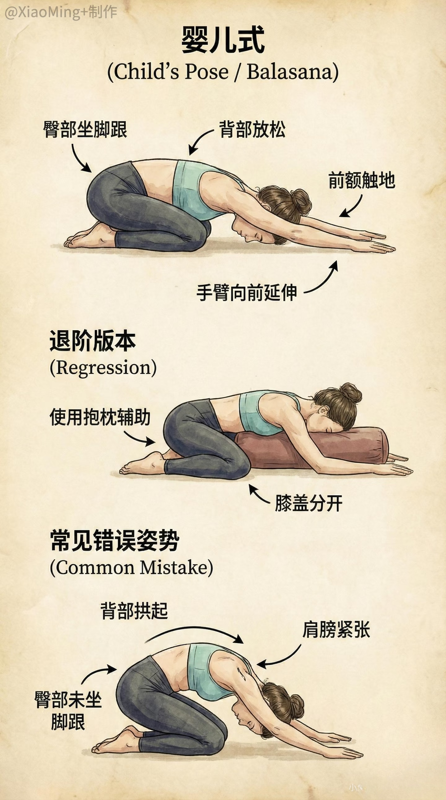
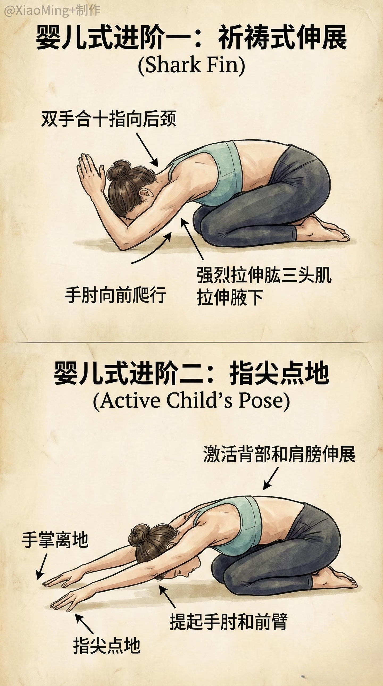
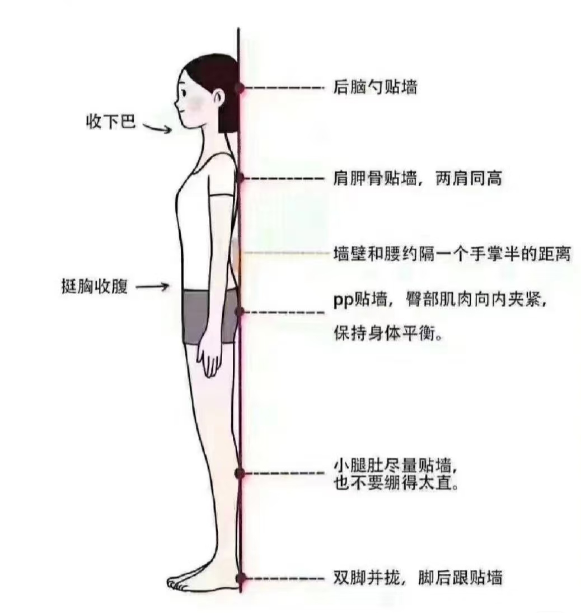
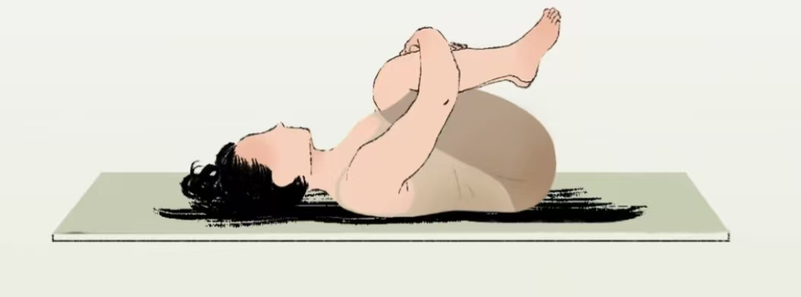
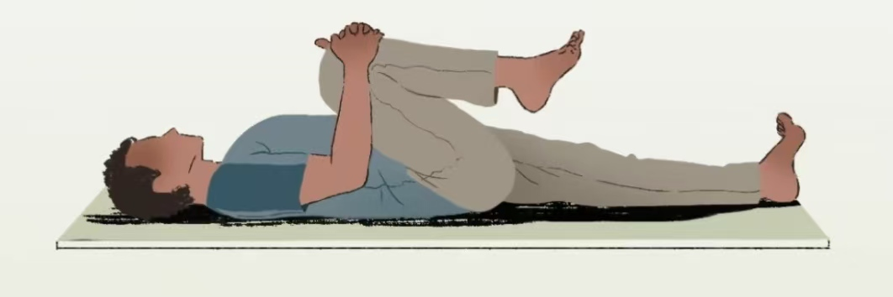

# spine-health
<!DOCTYPE html>
<html lang="zh-CN">
<head>
    <meta charset="UTF-8">
    <meta name="viewport" content="width=device-width, initial-scale=1.0, viewport-fit=cover, user-scalable=yes">
    <title>脊柱健康 · 知脊课堂 | 问答+图解放松 | 计算机设计大赛</title>
    <link href="https://fonts.googleapis.com/css2?family=Inter:opsz,wght@14..32,300;14..32,400;14..32,500;14..32,600;14..32,700&display=swap" rel="stylesheet">
    <link rel="stylesheet" href="https://cdnjs.cloudflare.com/ajax/libs/font-awesome/6.0.0-beta3/css/all.min.css">
    
</head>
<body>

    

        <h1><i class="fas fa-spine"></i> 脊柱健康 · 知脊课堂</h1>
        
📖 沉浸式问答 + 图解放松练习 | 剧本+医学双解析 

        

            10道硬核问答
            5个配图放松动作
            预防伤痛 · 主动养护
        

    

    

        <i class="fas fa-database"></i> 总题数: <strong id="totalCount">0</strong>
        <i class="fas fa-check-circle"></i> 点击「检查答案」
        <i class="fas fa-heartbeat"></i> 科学护脊
    

    

    <!-- 放松模块 (图片大幅放大) -->
    

        

            <i class="fas fa-hand-holding-heart"></i>
            脊柱放松 · 每日护脊小练习
        

        

            <i class="fas fa-leaf"></i> 劳累之后，花5分钟给脊柱做个“温柔SPA”。 
            ※ 点击图片可放大查看。图片已按规范命名，如需单文件分享请将图片转为Base64嵌入（见代码注释）。
        

        

            <!-- 收下巴 -->
            

                
                <h4>收下巴 · 解压颈椎</h4>
                
改善头前倾，即刻减轻颈部压力

                
✓ 坐直，水平后收下巴，像挤出双下巴 ✓ 保持3秒，重复10次

            

            <!-- 猫牛式 (放大) -->
            

                
                <h4>猫牛式 · 灵动脊柱</h4>
                
活动每一节椎骨，为椎间盘“补水”

                
✓ 四肢跪姿，吸气塌腰抬头 ✓ 呼气拱背低头，缓慢重复8次

            

            <!-- 婴儿式 双图 -->
            

                

                    
                    
                

                <h4>婴儿式 · 放松腰背</h4>
                
温和拉伸腰椎，舒缓下背紧张

                
✓ 跪姿，臀部坐脚跟，身体前屈 ✓ 双臂前伸，保持30秒深呼吸

            

            <!-- 靠墙站立 (放大) -->
            

                
                <h4>靠墙站立 · 重塑姿态</h4>
                
矫正驼背，恢复脊柱生理曲度

                
✓ 后脑、肩、臀、脚跟贴墙 ✓ 收下巴，保持3-5分钟

            

            <!-- 仰卧抱膝 双图 -->
            

                

                    
                    
                

                <h4>仰卧抱膝 · 舒缓骨盆</h4>
                
牵拉腰骶部，减轻腰椎压力

                
✓ 仰卧，双手抱膝靠近胸口 ✓ 自然呼吸，保持20秒，重复3次

            

        

        

            <i class="fas fa-lightbulb"></i> 💡 护脊小锦囊：
            久坐时屁股坐满椅面，腰后加靠枕，腰椎压力下降30%！
            <button class="tips-btn" id="refreshTipBtn"><i class="fas fa-sync-alt"></i> 换一条</button>
        

        

            <i class="fas fa-clock"></i> 每工作45分钟，起身活动2分钟 + 一组放松动作
        

    

    

        <i class="fas fa-leaf"></i> 解析融合剧本趣味与骨科医学共识  
 
    

<!-- 放大图片模态框 -->

    

</body>
</html>
